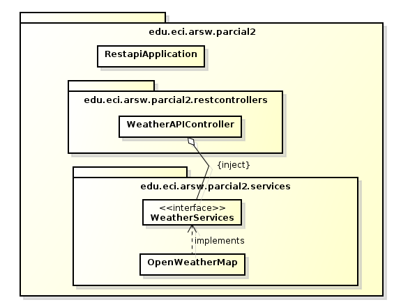

# Parcial Segundo Tercio ARSW

- Daniela González

### Descripción arquitectura

La arquitectura utiliza SpringBoot para realizar las inyecciones y aceptar multiples peticiones, tiene una controlador para aceptar peticiones HTTP realizadas desde una pagina web creada con Bootstrap, este controlador tiene inyectado un servicio que se encarga de realizar las consultas del clima de una ciudad en específico a un API externo. Si se requiere cambiar el API solo se necesita cambiar la inyección a la clase del nuevo api.

### Link de Heroku 

- https://parcialarsw-2.herokuapp.com/

### Link de GitHub

- https://github.com/danielagon/Parcial2-ARSW
